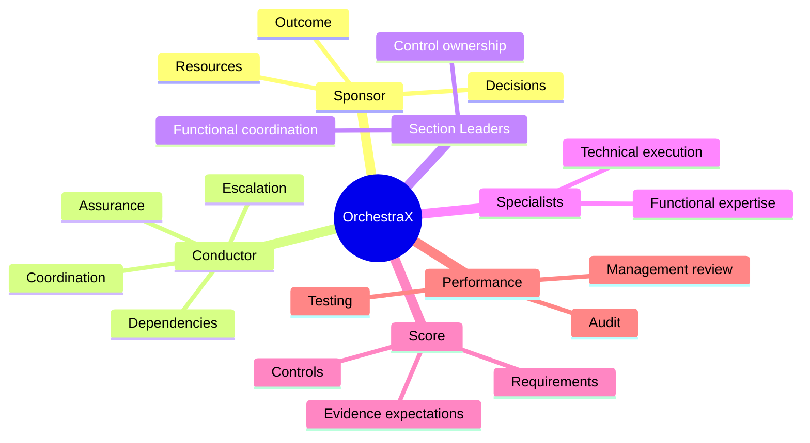

# Musical Roles and GRC Roles

| Musical role | GRC / PM role | Primary responsibility |
|---|---|---|
| Composer | Sponsor / management | Defines desired outcome and strategic direction |
| Conductor | GRC Lead / PM | Coordinates the system |
| Section leader | Control owner / functional lead | Owns a defined area |
| Musician | SME / contributor | Performs specialist work |
| Orchestra | Project team | Executes collectively |
| Score | Requirements / control framework | Defines what must be achieved |
| Audience | Stakeholder / auditor / client | Receives or evaluates the outcome |

## Four-Hands Principle

A four-hands piano arrangement is useful for modeling shared ownership of one outcome.

Example: **PAM implementation**

- IT owns technical configuration and deployment.
- GRC owns requirements, risk interpretation, governance, evidence and assurance.

They are not doing the same job.

They are synchronizing different specialist contributions toward one control objective.

> Collaboration is not two people doing the same job. It is two specialists synchronizing different parts of the same outcome.

## Boundary

Roles remain accountable for their assigned responsibilities. The analogy is intended to clarify coordination, not erase organizational accountability.

## Role Mind Map

This is the quick-recall model for the project's role hierarchy.
