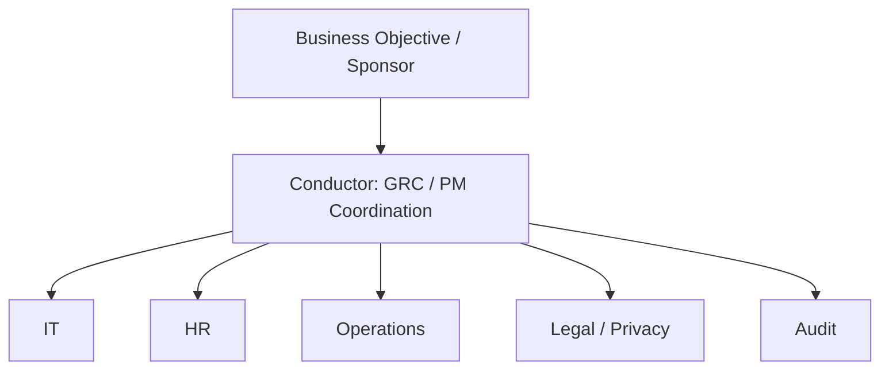

# Orchestra to GRC Systems Map

## System View

The laboratory treats GRC as a coordinated system rather than a collection of isolated documents.

The conductor sits across this flow as the coordination layer.

## System Failure Patterns

| Musical problem | Systems interpretation |
|---|---|
| Wrong tempo | Schedule/dependency mismatch |
| Missing musician | Unclear ownership or unavailable SME |
| Wrong instrument | Control design does not address the actual objective |
| Too loud | Control creates disproportionate business friction |
| Wrong notes | Process/evidence does not match the documented requirement |
| Poor transition | Weak handoff between teams |
| Section out of sync | Cross-functional dependency failure |
| Recovery after mistake | Incident/risk response and corrective action |

## Key Lesson

A control can exist on paper while the overall system still performs poorly.

This distinction will later connect to:

- control design effectiveness
- operating effectiveness
- evidence quality
- ownership
- dependencies
- risk treatment
- corrective action
