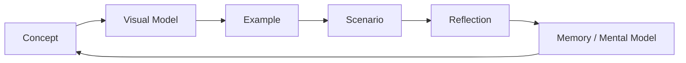
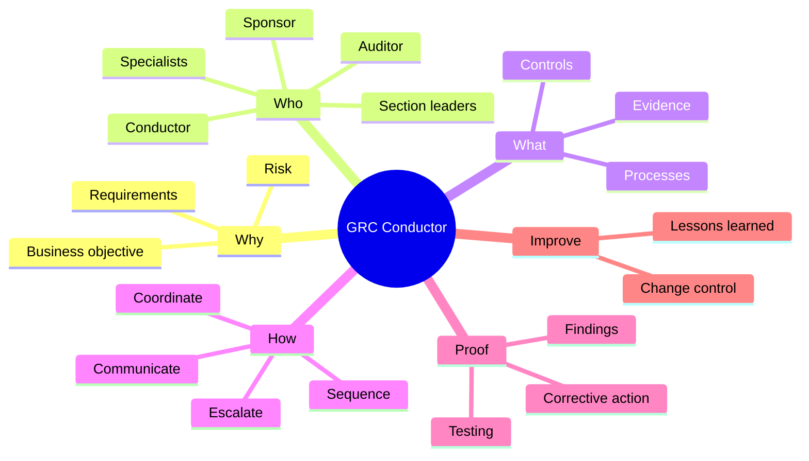

# Visual Learning System

## Why This Exists

This laboratory is designed for active, visual learning. Plain English explains a concept; visuals show how the parts relate.

For concepts involving **relationships, sequence, hierarchy, ownership, dependency or decisions**, a visual model should normally accompany the explanation.

## Visual Selection Guide

| If the concept is about... | Prefer |
|---|---|
| Relationships | Mind map / system map |
| Sequence | Flowchart |
| Ownership | RACI / responsibility map |
| Requirements to evidence | Traceability chain |
| Decision logic | Decision tree |
| Events over time | Timeline |
| Cross-functional work | Swimlane / dependency map |
| Quick recall | One-page mental model |

## Visual-First Learning Loop

## ADHD Design Rule

A visual is not decoration.

It should reduce working-memory load by making at least one of these easier to see:

- **What connects to what?**
- **Who owns what?**
- **What happens next?**
- **Where can the process fail?**
- **What evidence proves completion?**

## Project-Wide Mental Model

## Visual Quality Rule

Do not create a diagram merely to make a page look visual.

Every diagram must answer a question that would be harder to answer from prose alone.
