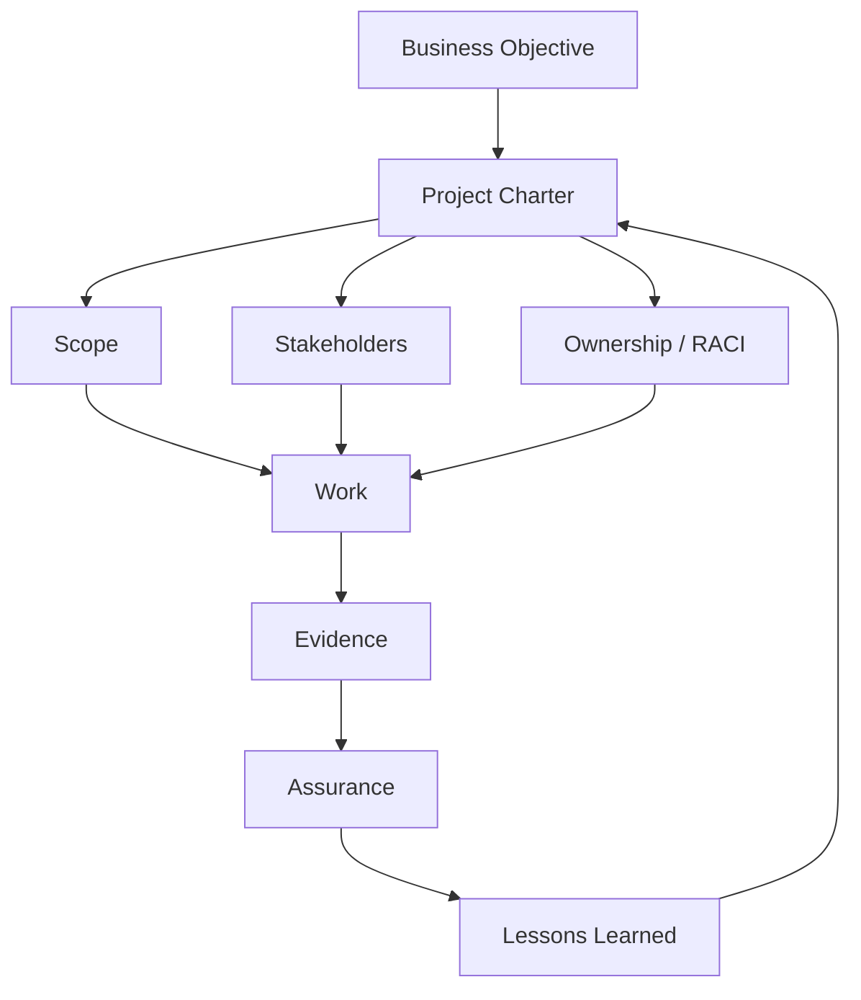

# Project Charter — OrchestraX GRC Systems Lab

## Project Name

**OrchestraX Information Security Coordination Program**

## Project Purpose

OrchestraX is a fictional small technology organization preparing to establish an information security management system aligned with ISO/IEC 27001.

This laboratory simulates the coordination challenges involved in that journey.

## Business Objective

Establish a repeatable information-security governance system that:

- identifies relevant risks
- assigns accountable owners
- implements appropriate controls
- produces usable evidence
- supports internal assurance
- enables management decision-making

## Project Objectives

1. Define scope and stakeholders.
2. Establish ownership using RACI.
3. Map requirements to controls and responsibilities.
4. Identify dependencies and delivery risks.
5. Coordinate implementation activities.
6. Test whether controls operate as intended.
7. Simulate audit and corrective-action activities.
8. Document lessons learned.

## Scope

### In Scope

- GRC coordination
- project management
- information-security governance
- risk management
- control ownership
- evidence management
- internal audit simulation
- corrective action
- stakeholder coordination

### Out of Scope

- Building production software
- Performing real penetration tests
- Certifying an organization
- Providing legal advice
- Replacing an actual ISO/IEC 27001 implementation methodology

## Success Criteria

The project is successful when the laboratory can demonstrate:

- clear ownership
- traceable requirements
- coordinated dependencies
- documented risks and decisions
- testable controls
- auditable evidence
- structured corrective actions
- a clear explanation of how the coordinator adds value without replacing specialists

## Project Mental Model

### One-Line Recall

**Why → What → Who → How → Proof → Assurance → Improve**
