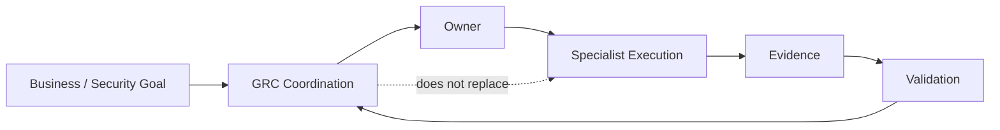

# Project Scope

## Project
OrchestraX Information Security Coordination Program

## Purpose

Define what the GRC/project coordination function coordinates, monitors, and assures without taking ownership of specialist execution.

## In Scope

- Information security governance coordination
- ISO/IEC 27001-aligned control coordination
- Stakeholder identification and communication
- Control ownership and accountability
- RACI definition
- Project dependencies and sequencing
- Risk and issue coordination
- Evidence readiness
- Internal review and audit preparation
- Corrective-action tracking
- Management reporting

## Out of Scope

- Writing production software
- Performing every technical security task
- Acting as the sole owner of specialist controls
- Replacing IT, HR, Legal, Privacy, or Operations expertise
- Making technical implementation decisions without the responsible specialist

## Scope Boundary

The conductor coordinates the system; specialists execute their parts.

> Coordination does not equal execution.

## Scope Test

For any task, ask:

1. Who owns the outcome?
2. Who performs the work?
3. Who must be consulted?
4. Who needs to be informed?
5. What dependency could prevent completion?
6. What evidence will demonstrate completion?

## Portfolio Learning Objective

Practice distinguishing **coordination work** from **specialist execution work**.

## Scope Boundary Visual

### Quick Filter

If the question is **"Who performs the specialist work?"**, find the owner.

If the question is **"How do all the parts stay aligned?"**, that is the conductor's coordination problem.
