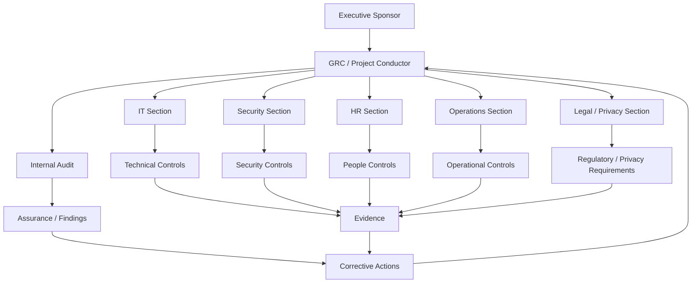

# OrchestraX Organization Map

## System View

The organization is modeled as an orchestra because the security program is an interdependent system.

## Coordination Layer

The GRC/project conductor sits between the business objective and specialist execution.

The conductor does not replace the sections. The conductor makes sure that:

- the right section knows what is required;
- ownership is explicit;
- dependencies are visible;
- timing is coordinated;
- blockers are escalated;
- evidence is produced;
- gaps are tracked through closure.

## Section Model

### IT Section

Examples:

- Identity and access systems
- Endpoint management
- Cloud infrastructure
- Logging
- Backup
- Vulnerability remediation

### Security Section

Examples:

- Security monitoring
- Incident response
- Risk treatment
- Security testing
- Security awareness

### HR Section

Examples:

- Joiner/mover/leaver processes
- Personnel records
- Awareness administration
- Employment lifecycle evidence

### Operations Section

Examples:

- Business procedures
- Supplier coordination
- Operational continuity
- Process execution

### Legal / Privacy Section

Examples:

- Regulatory interpretation
- Privacy requirements
- Contractual obligations
- Data protection considerations

### Internal Audit

Provides independent assurance rather than owning implementation.

## System-Thinking Question

When a control fails, do not immediately ask:

> "Who made the mistake?"

First ask:

> "Where did the system allow the failure to occur?"
