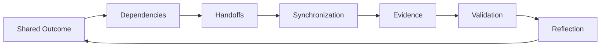
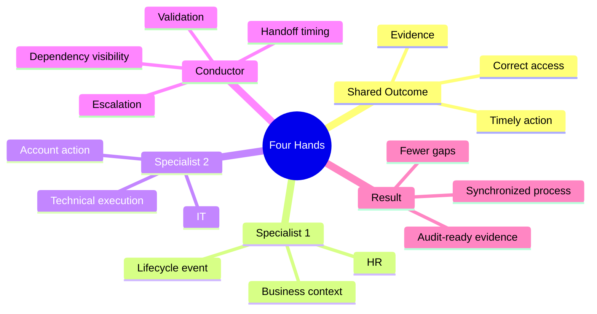

# v0.4 — Four Hands

## Purpose

Four Hands introduces a core conductor skill: **coordinating specialists who own different parts of the same outcome**.

The musical analogy is intentionally narrow:

> Two players do not become effective because they play the same part. They become effective when their different parts are synchronized.

In OrchestraX, this means GRC, IT and HR may contribute to one access-management outcome while retaining different responsibilities.

## Core Principle

**Collaboration is not two people doing the same job. It is two specialists synchronizing different parts of the same outcome.**

## What Changes from v0.3

v0.3 established:

**Requirement → Control → Owner → Implementation → Evidence → Validation**

v0.4 adds the coordination layer:

**Dependency → Handoff → Synchronization → Shared Outcome**

The conductor's job is to make the handoffs visible before they become failures.

## Learning Loop

## Anchor Scenario

The scenario uses the existing **Joiner-Mover-Leaver (JML) access process**.

No new control is introduced. The scenario deliberately reuses:

- A.5.16 Identity management
- A.5.18 Access rights
- existing OrchestraX roles
- the existing RACI
- the existing control matrix

This keeps v0.4 connected to the established source of truth.

## Four Hands Mental Model

## Memory Hook

**Same outcome. Different hands. One coordinated performance.**
