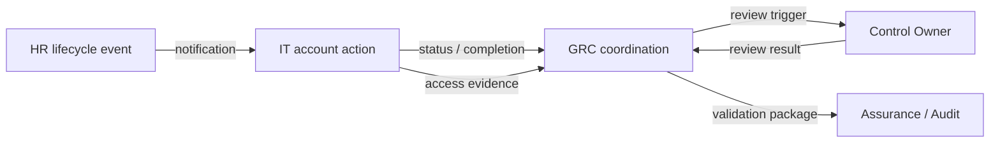
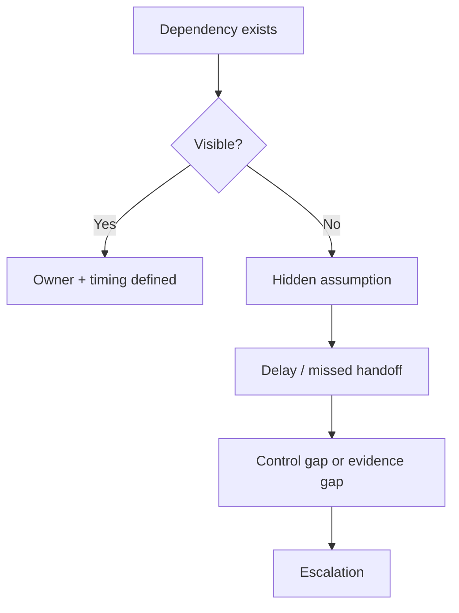

# Dependencies — Four Hands

## Purpose

A dependency exists when one activity cannot complete correctly without another activity, input or decision.

The conductor does not remove every dependency.

The conductor makes dependencies **visible, owned and sequenced**.

## JML Dependency Map

### What the Diagram Shows

- HR owns the lifecycle signal.
- IT performs the technical account action.
- GRC coordinates timing, dependencies and evidence.
- The control owner remains accountable for the control outcome according to the existing RACI.
- Assurance validates rather than performs the operational work.

## Dependency Types

| Dependency | Example | Conductor Question |
|---|---|---|
| Information | HR must provide a leaver notification | Do we know when the signal will arrive? |
| Action | IT must disable the account | Who performs the action? |
| Decision | Owner must resolve an exception | Who has authority to decide? |
| Evidence | Access action must be recorded | What proves the action happened? |
| Timing | Review must follow the lifecycle event | What happens first, and by when? |

## Dependency Failure Pattern

## Conductor Rule

Do not ask only:

> "Who owns the control?"

Also ask:

> "What must happen before this person can perform their part correctly?"

That second question exposes dependencies.

## Relationship to RACI

RACI answers **who is Responsible and Accountable**.

Dependency mapping answers **what must happen between those responsibilities**.

They complement each other; they do not replace each other.
