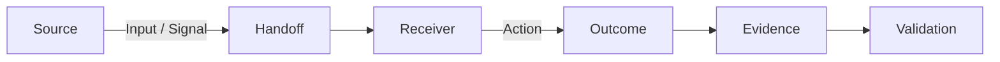
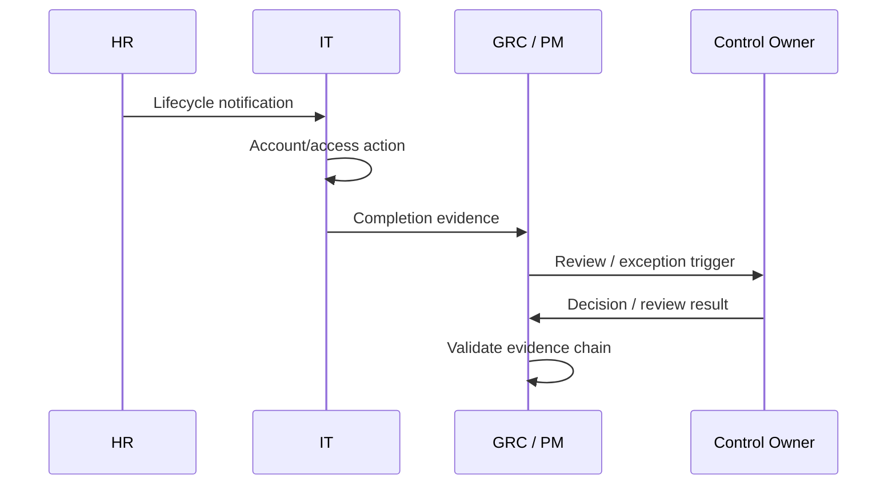

# Handoffs — Four Hands

## Purpose

A handoff is the transfer of an input, action, decision or result from one role to another.

Many coordination failures occur not inside a task, but **between tasks**.

## Handoff Model

A good handoff makes five things clear:

1. **What** is being transferred?
2. **Who** sends it?
3. **Who** receives it?
4. **When** must it arrive?
5. **How** is completion confirmed?

## JML Swimlane

## Weak vs Strong Handoff

| Weak | Strong |
|---|---|
| "HR informed IT." | HR sends a defined lifecycle event through the agreed channel. |
| "IT removed access." | IT records the action and completion evidence. |
| "GRC followed up." | GRC tracks dependency status and escalates when the agreed condition is missed. |
| "Review completed." | Reviewer records result, exceptions and follow-up action. |

## Handoff Checklist

Before a handoff is considered complete:

- [ ] Sender identified
- [ ] Receiver identified
- [ ] Trigger defined
- [ ] Expected input/output defined
- [ ] Timing or SLA defined where applicable
- [ ] Evidence location known
- [ ] Exception/escalation path known
- [ ] Receiver confirms usable input

## Memory Hook

**A task can be well executed and the overall process can still fail if the handoff is weak.**
