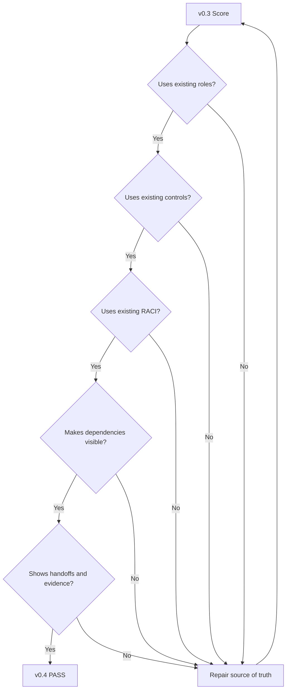

# v0.4 Quality Gate — Four Hands

## Gate Objective

Confirm that collaboration, dependencies and handoffs have been added without creating disconnected roles, controls or processes.

## Continuity Check

## Gate Results

| Check | Result | Evidence |
|---|---|---|
| Existing roles reused | PASS | HR, IT, GRC/PM, Control Owner |
| Existing controls reused | PASS | A.5.16 and A.5.18 |
| Existing RACI respected | PASS | JML and access activities remain anchored to v0.2 RACI |
| Dependencies visible | PASS | Dependency map |
| Handoffs visible | PASS | Handoff model and swimlane |
| Evidence linkage preserved | PASS | Scenario follows action → evidence → validation |
| No new orphan control introduced | PASS | Scenario uses v0.3 control set |
| Visual-first requirement met | PASS | Mind map, flowcharts, sequence diagram |
| Future-phase connection preserved | PASS | Scenario prepares for conductor decision scenarios and later rehearsal/audit testing |

## Decision

**v0.4 is structurally ready to proceed to v0.5 — Conductor.**

## Core Learning Outcome

v0.4 adds a distinction that will remain important throughout the laboratory:

> **RACI tells us who owns the parts. Dependency and handoff analysis tells us how those parts must connect.**

That connection is where the conductor becomes necessary.
