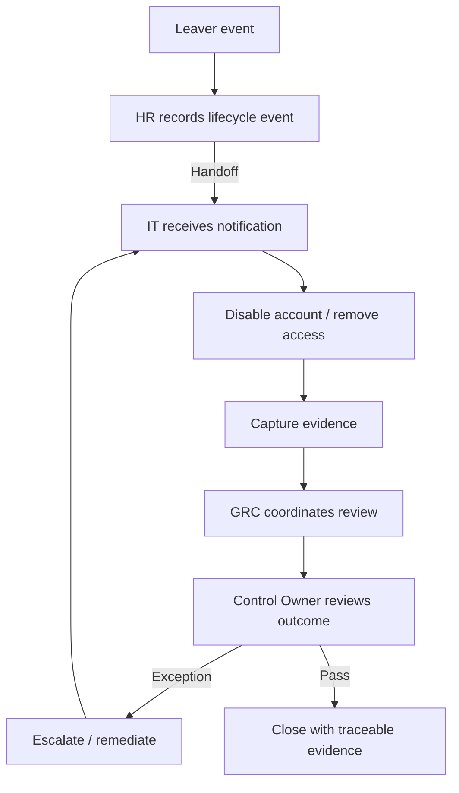

# Scenario — The JML Four-Hands Rehearsal

## Scenario

A member of OrchestraX leaves the organization.

HR knows the employment relationship has ended.

IT must remove the user's access.

GRC needs enough evidence to verify that the process operated correctly.

The control owner needs confidence that the access-rights outcome was achieved.

No single role can complete the whole outcome alone.

## Visual Scenario

## Four Hands Analysis

| Role | Their Part | What They Need from Others |
|---|---|---|
| HR | Confirm lifecycle event | Correct technical handoff |
| IT | Execute access action | Accurate and timely HR signal |
| GRC / PM | Coordinate dependency and evidence flow | Status and usable evidence |
| Control Owner | Own control outcome / review | Evidence and exception information |

## Failure Point 1 — Late Notification

**Problem:** HR notification reaches IT after the expected action window.

**Conductor questions:**

- Where did the dependency fail?
- Was the expected timing defined?
- Who should escalate?
- Is the issue a process design problem or an execution problem?

## Failure Point 2 — Action Completed, No Evidence

**Problem:** IT removed access but cannot demonstrate when or how it happened.

**Conductor questions:**

- Did the process define an evidence requirement?
- Is the control operating but poorly evidenced?
- What evidence source should exist?
- Does the gap affect validation?

## Failure Point 3 — Evidence Exists, Outcome Is Wrong

**Problem:** A ticket says access was removed, but a later sample shows a residual entitlement.

**Conductor questions:**

- Is this a design issue, operating failure or exception?
- Which owner must act?
- What corrective action is required?
- How will the remediation be re-tested?

## The Conductor's Role

The conductor should not respond by performing IT's work.

The conductor should:

1. identify the failed handoff;
2. determine the responsible and accountable roles using the existing RACI;
3. assess impact;
4. coordinate the next action;
5. escalate when authority or timing requires it;
6. preserve the evidence trail;
7. ensure the outcome is re-validated.

## Mental Model

**Signal → Handoff → Action → Evidence → Review → Validation**

If one link breaks, the conductor looks at the **system**, not only the individual task.
