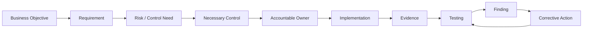
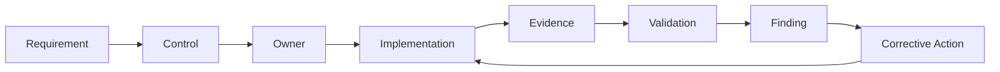

# Control Matrix

## Purpose

The control matrix connects the score to the orchestra.

It is the first formal traceability layer between requirements, controls, ownership, evidence and assurance.

| Control ID | Requirement | Control Outcome | Accountable | Responsible | Evidence | Validation |
|---|---|---|---|---|---|---|
| A.5.15 | REQ-02 | Access rules reflect business need | Security Lead | IT Lead | Access policy / review records | Sample access review |
| A.5.16 | REQ-03 | Identities are managed through lifecycle events | IT Lead | IT + HR | JML records | Lifecycle sample |
| A.5.18 | REQ-02 / REQ-03 | Access rights are provisioned, reviewed and removed | Control Owner | IT | Access requests / review results | Rights sample |
| A.5.24 | REQ-04 | Incident response is prepared and coordinated | Security Lead | Security / IT | IR plan / exercise records | Tabletop or record review |
| A.8.8 | REQ-05 | Technical vulnerabilities are identified and treated | IT Lead | IT / Security | Scan and remediation records | Risk-based sample |
| A.8.15 | REQ-06 | Relevant activity is logged and usable | Security Lead | IT | Log configuration / samples | Log availability test |
| A.8.32 | REQ-07 | Security-relevant changes are controlled | IT Lead | IT | Change records | Change sample |

## Traceability Chain

## Matrix Rules

A row is not considered complete merely because every column contains text.

The conductor must be able to explain:

1. Why the control exists.
2. What outcome it is supposed to achieve.
3. Who is accountable.
4. Who actually performs the work.
5. What evidence should exist.
6. How an independent reviewer could test it.
7. What happens if the control fails.

## Design vs Operation

The project will distinguish:

**Control design:** Is the control appropriately designed to address the intended risk?

**Control operation:** Is the control actually operating as designed?

**Evidence:** Can the organization demonstrate what happened?

A policy alone does not prove effective operation.

## Matrix Mental Model

### Evidence Ladder

**Documented ≠ Implemented ≠ Operating ≠ Effective ≠ Proven**

Later rehearsal and audit scenarios will deliberately test these distinctions.
