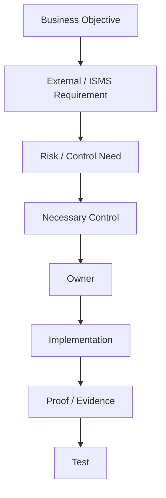

# The Score — Requirements

## Purpose

The "score" translates the OrchestraX business objective into requirements that specialists can execute and the conductor can coordinate.

OrchestraX is using **ISO/IEC 27001:2022** as the primary reference framework for this simulation. ISO describes ISO/IEC 27001 as the requirements standard for an Information Security Management System (ISMS). The current published standard has a 2024 amendment concerning climate action. [ISO reference](https://www.iso.org/standard/27001)

## Requirement Hierarchy

The project deliberately separates four layers:

1. **Business objective** — why the organization needs the program.
2. **ISMS requirement / external requirement** — what the governing framework requires.
3. **Control objective / necessary control** — what risk treatment needs to achieve.
4. **Implementation requirement** — what the responsible team must actually do.

A control is not automatically necessary merely because a control appears in Annex A. ISO/IEC 27001 uses a risk-based process to determine necessary controls and requires comparison against Annex A to check that necessary controls have not been omitted.

## OrchestraX Business Objective

> Establish a coordinated information security management system that manages information-security risk and produces reliable evidence of how controls operate.

## Learning Requirements

| ID | Requirement | Owner | Evidence Concept |
|---|---|---|---|
| REQ-01 | Security governance and ownership must be defined | GRC / Sponsor | Governance records |
| REQ-02 | Access must be governed according to business need | IT / Security | Access records and reviews |
| REQ-03 | Joiner, mover and leaver events must drive appropriate access actions | HR / IT | JML records |
| REQ-04 | Security events must have a defined response process | Security | Incident records |
| REQ-05 | Vulnerabilities must be identified, assessed and addressed according to risk | IT / Security | Scan and remediation records |
| REQ-06 | Relevant security activity must produce usable evidence | Control Owners | Evidence repository |
| REQ-07 | Changes affecting security must be controlled | IT / Control Owners | Change records |
| REQ-08 | Control performance must be reviewed and improvement actions tracked | GRC / Control Owners | Review and corrective-action records |

## Important Distinction

The conductor should never stop at:

> "Do we have a policy?"

The sequence is:

**Requirement → Risk → Necessary control → Owner → Implementation → Evidence → Testing → Finding → Corrective action**

## Score Integrity Rule

Every requirement introduced later in the project must be traceable to:

- a business or compliance need;
- an identified risk or control objective;
- an accountable owner;
- an implementation activity;
- evidence;
- a validation method.

If one of these links is missing, the requirement is not ready to enter a rehearsal scenario.

## Score Mental Model

### Memory Hook

**Why → Requirement → Risk → Control → Owner → Do → Prove → Test**
