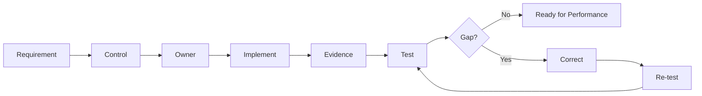

# v0.7 — Rehearsal

## Purpose
Move OrchestraX from coordination into controlled execution.

> **Rehearsal = implementation + evidence + testing + feedback.**

## Core Loop
**Plan → Execute → Capture → Test → Find Gap → Correct → Re-test → Ready**

## Existing System Reused
- OrchestraX roles and RACI
- Existing requirements and control matrix
- Existing dependency and handoff model
- v0.6 disruption/recovery model
- Existing evidence and validation chain

No new control is introduced merely to support the rehearsal exercises.

## Rehearsal Scenarios
1. Access Control & JML — A.5.15, A.5.16, A.5.18
2. Incident Response — A.5.24, A.8.15
3. Vulnerability Management — A.8.8, A.8.32
4. Evidence Testing — existing control matrix

## Evidence Ladder
**Documented ≠ Implemented ≠ Operating ≠ Effective ≠ Proven**

## Phase Connection
Four Hands → Conductor → Injury → **Rehearsal** → Performance / Audit

## Quality Gate
Implementation must be traceable, ownership aligned, evidence attributable, testing meaningful, failures correctable and re-testable, and v0.8 audit simulation supported.

> **The conductor does not declare the orchestra ready. The rehearsal produces evidence that the system is ready.**
