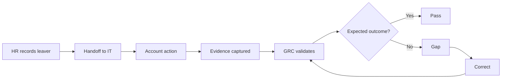

# Rehearsal 01 — Access Control & JML

## Objective
Demonstrate that an employee lifecycle event triggers the expected access action and produces traceable evidence.

**Controls:** A.5.15, A.5.16, A.5.18  
**Requirements:** REQ-02, REQ-03, REQ-06

## Expected Evidence
- authoritative lifecycle notification
- account/access action record
- timestamps
- responsible actor
- validation result

A reviewer should be able to answer: **What triggered it? Who acted? What changed? When? How was it verified?**

## Test Cases
| Test | Expected result |
|---|---|
| Valid leaver event | IT receives the required handoff |
| Account action | Access is disabled/removed as designed |
| Evidence | Action is attributable and timestamped |
| Validation | Event → action → evidence is traceable |
| Exception | Delay/failure has an escalation path |

## Failure Example
The account is disabled but no reliable evidence is retained. The technical action may have occurred, but demonstrability is incomplete. Do not fabricate evidence; identify authoritative evidence or correct the process and re-test.

> **A successful access action without reliable evidence is an incomplete rehearsal.**
