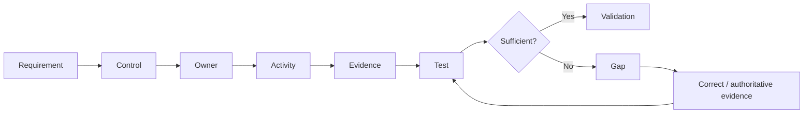

# Rehearsal 04 — Evidence Testing

## Objective
Test whether evidence allows a reviewer to determine that a control was implemented and operated as intended.

## Evidence Quality Questions
1. **Relevance** — Does it relate to the control?
2. **Attribution** — Can the action/person/system be identified?
3. **Timing** — Does it demonstrate the required period or event?
4. **Completeness** — Is the important activity visible?
5. **Integrity** — Is the source reasonably authoritative for the purpose?
6. **Traceability** — Can it be linked to the requirement/control?
7. **Repeatability** — Could another reviewer reach the same conclusion?

## Test Results
| Result | Meaning |
|---|---|
| Pass | Evidence supports the expected outcome |
| Pass with observation | Outcome is demonstrated but quality can improve |
| Gap | Outcome or demonstrability is not established |
| Unable to validate | Evidence/access is insufficient for a reliable conclusion |

## Important Boundary
Do not confuse **no evidence found**, **evidence exists elsewhere**, **evidence is incomplete**, and **control did not operate**. They require different responses.

> **A re-test asks whether the correction changed the result, not whether someone says it was corrected.**
