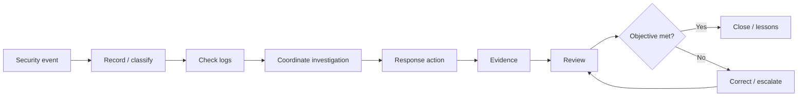

# Rehearsal 02 — Incident Response

## Objective
Demonstrate that a simulated security event can be identified, coordinated, recorded, and supported by relevant logs.

**Controls:** A.5.24, A.8.15  
**Requirements:** REQ-04, REQ-06

## Rehearsal Questions
- Was the event recognized and recorded?
- Was the response path known?
- Were relevant logs available?
- Could the team establish a timeline?
- Were actions and decisions attributable?
- Was escalation used when required?

## Evidence
Incident record, relevant log references, investigation timeline, response actions, escalation/decision record, and closure/lessons record.

## Failure Example
A required log source is unavailable. Determine whether the issue is configuration, retention/availability, access, process, or evidence handling. Assign correction and re-test the affected outcome.

> **Incident response includes the ability to establish what happened, what was done, and why.**
