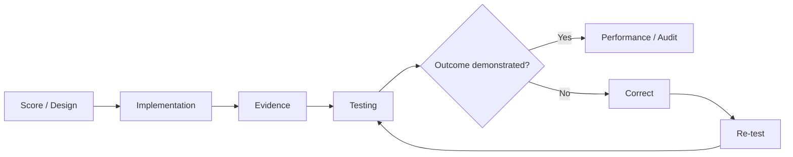

# v0.7 Quality Gate — Rehearsal

## Gate Objective
Determine whether OrchestraX has moved from documented design into controlled implementation and testing.

| Check | Result |
|---|---|
| Existing requirements reused | PASS |
| Existing controls reused | PASS |
| Existing RACI respected | PASS |
| Dependencies and handoffs preserved | PASS |
| Implementation path visible | PASS |
| Evidence expectations defined | PASS |
| Testing method defined | PASS |
| Failure → correction → re-test defined | PASS |
| Technical outcome distinguished from evidence quality | PASS |
| Risk treatment distinguished from action completion | PASS |
| v0.6 disruption model remains usable | PASS |
| No orphan controls introduced | PASS |
| Visual-first standard met | PASS |
| v0.8 audit simulation supported | PASS |

## Combined Learning
- **Four Hands:** How must specialists connect?
- **Conductor:** How should coordination and decisions happen?
- **Injury:** How do we preserve the outcome under disruption?
- **Rehearsal:** Can the implemented system demonstrate the intended outcome?

## Core Lesson
> **A control is not ready because it is documented. It is ready when implementation, evidence, testing, and correction provide reasonable confidence in the intended outcome.**

## v0.7 Decision
**PASS — Rehearsal framework is ready to transition to v0.8 Performance / Audit Simulation.**
