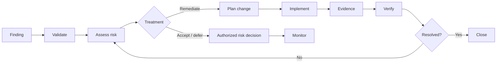

# Rehearsal 03 — Vulnerability Management

## Objective
Demonstrate that a vulnerability moves from identification through risk-based treatment and controlled remediation.

**Controls:** A.8.8, A.8.32  
**Requirement:** REQ-05

## Rehearsal Questions
- Is the finding attributable to an asset?
- Was it validated?
- Was risk considered before treatment?
- Is remediation controlled as a change where applicable?
- Is the action evidenced?
- Was the result verified?

## Failure Example
A patch is installed but follow-up validation still detects the vulnerability. Do not close the finding merely because the action was performed.

> **Action completed ≠ risk resolved.**
