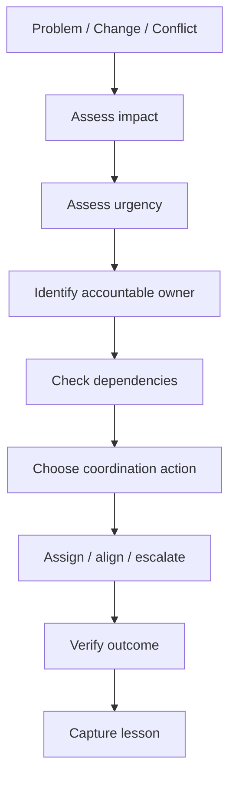

# v0.5 — Conductor

## Purpose

v0.4 established how specialists connect.

v0.5 asks the harder question:

> **When several things need attention at the same time, what should the conductor do first?**

The conductor is not the person who performs every task. The conductor creates alignment by deciding **what needs attention, who should act, when it matters, and when escalation is required**.

## Decision Model

## The Conductor's Five Questions

1. **What changed?**
2. **What is the impact if we do nothing?**
3. **Who has authority to act?**
4. **What dependency or deadline matters?**
5. **How will I know the situation is resolved?**

## Decision Boundaries

The conductor should distinguish:

| Situation | Conductor response |
|---|---|
| Specialist can resolve within authority | Coordinate and monitor |
| Two teams have a dependency conflict | Clarify sequence and ownership |
| A decision exceeds team authority | Escalate to the accountable decision-maker |
| Risk is increasing | Surface impact and coordinate treatment |
| Evidence is missing | Identify evidence owner and validation path |
| Control appears ineffective | Trigger investigation/remediation and re-test |

## Memory Hook

**See → Prioritize → Coordinate → Escalate → Verify → Learn**

This is the v0.5 conductor loop.
