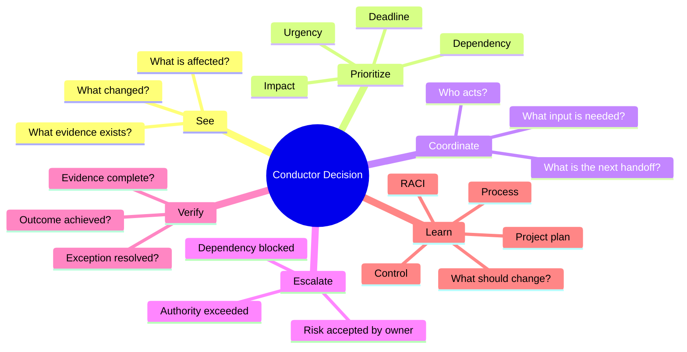

# Conductor Decision Framework

## Purpose

This framework converts a vague coordination problem into a repeatable decision sequence.

## Decision Stack

## Priority Is Not Just Urgency

A loud problem is not automatically the most important problem.

A useful conductor looks at at least four dimensions:

- **Impact** — what happens if the issue persists?
- **Urgency** — how quickly must action occur?
- **Dependency** — what other work is blocked or exposed?
- **Deadline** — is there a fixed milestone, review or commitment?

The point is not to calculate a universal score. The point is to make the reasoning visible.

## Decision Record

For a coordination decision, capture:

| Field | Question |
|---|---|
| Situation | What happened? |
| Impact | What could be affected? |
| Current evidence | What do we actually know? |
| Accountable owner | Who owns the outcome? |
| Options | What practical actions exist? |
| Decision | What coordination action was selected? |
| Escalation | Was authority sufficient? |
| Follow-up | How will closure be verified? |

## Anti-Pattern

**"I will fix it myself."**

That can hide the real ownership problem.

The conductor should normally restore coordination rather than silently becoming the missing specialist.
