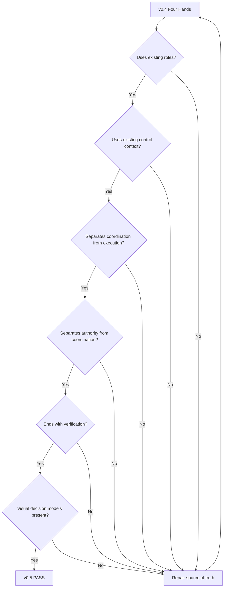

# v0.5 Quality Gate — Conductor

## Gate Objective

Confirm that v0.5 teaches coordination decisions without turning the conductor into a universal executor or unauthorized decision-maker.

## Visual Gate

## Gate Results

| Check | Result |
|---|---|
| Existing OrchestraX roles reused | PASS |
| Existing control context reused | PASS |
| Coordination separated from specialist execution | PASS |
| Authority separated from coordination | PASS |
| Evidence and verification preserved | PASS |
| Decision scenarios included | PASS |
| Visual-first standard met | PASS |
| Future disruption phase supported | PASS |

## Decision

**v0.5 is structurally ready to proceed to v0.6 — The Injury.**

## Core Learning Outcome

v0.4 taught:

**How do different specialists connect?**

v0.5 adds:

**What does the conductor do when the connected system has a problem?**

The answer is not "do everyone's job."

It is:

**See → Prioritize → Coordinate → Escalate → Verify → Learn**
