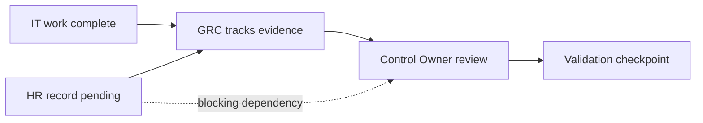

# Scenario 01 — The Wrong Tempo

## Situation

OrchestraX is preparing evidence for an access review.

- IT has completed its technical work.
- HR has not yet supplied one required lifecycle record.
- The control owner has a review dependency.
- The planned validation checkpoint is approaching.

The problem is not that one person is simply "slow".

The system has a sequencing dependency.

## Visual

## Conductor Analysis

### See

The missing HR record is blocking a downstream review.

### Prioritize

The conductor checks:

- impact on the control review;
- time remaining before validation;
- whether an alternate authoritative record exists;
- whether the missing input is genuinely required.

### Coordinate

The conductor does **not** fabricate or substitute evidence.

Instead:

1. confirm the missing input with HR;
2. confirm the requirement with the control owner;
3. establish the next handoff;
4. track the dependency to closure.

### Escalate

If the dependency cannot be resolved within the required window, escalate to the accountable role rather than allowing the deadline to silently fail.

### Verify

The review proceeds only when the required input is available or an authorized decision has documented how the exception is handled.

## Learning Point

**Tempo problems are often dependency problems.**

The conductor's value is making the dependency visible early enough to coordinate it.
