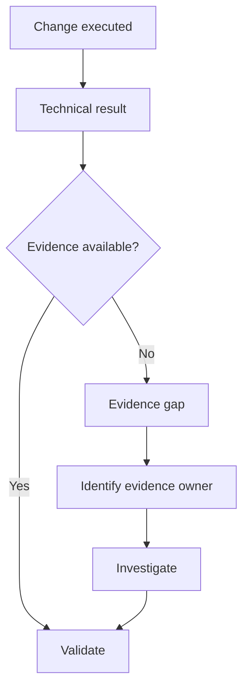

# Scenario 02 — The Missing Proof

## Situation

IT reports that a security-relevant change was completed correctly.

The change itself appears successful.

However, the expected change record cannot be located.

## Visual

## Conductor Analysis

The conductor should distinguish three questions:

1. **Did the technical change happen?**
2. **Was the change performed through the expected process?**
3. **Can the organization demonstrate this reliably?**

These are related but not identical.

## Response

- Do not immediately declare the control failed solely because one record is missing.
- Determine what evidence exists and whether it is authoritative.
- Identify whether the issue is isolated or systemic.
- Coordinate the responsible owner to reconstruct or correct the record where appropriate.
- Escalate if the missing evidence prevents required validation.
- Record the outcome and improve the process if the failure indicates a recurring weakness.

## Learning Point

**Evidence is part of the system, not paperwork added after the work.**
