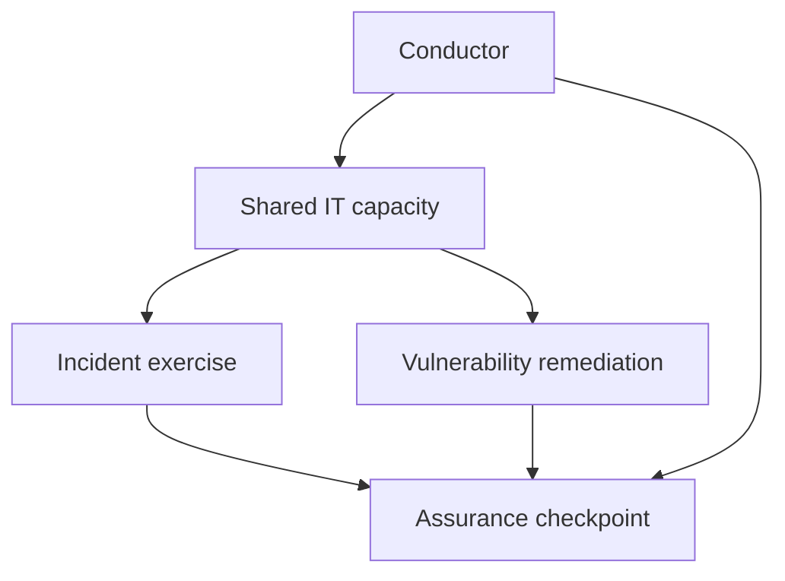

# Scenario 03 — Two Sections, One Deadline

## Situation

Security wants an incident-response exercise completed before the next assurance checkpoint.

IT is simultaneously prioritizing vulnerability remediation work.

Both activities involve the same specialists.

## Visual

## Conductor Analysis

This is a resource and sequencing conflict.

The conductor should not simply declare one team "more important."

Instead, establish:

- which deliverable has the harder dependency;
- which work is risk-sensitive;
- what can be parallelized;
- what can be delegated;
- whether scope can be safely adjusted;
- which decision requires accountable management approval.

## Possible Coordination Actions

- sequence tasks around the assurance dependency;
- split work between available specialists;
- reduce non-essential scope without weakening the required outcome;
- escalate a resource constraint;
- document an accepted risk or schedule change when authorized.

## Learning Point

**Coordination is not command-and-control. It is structured decision-making under constraints.**
