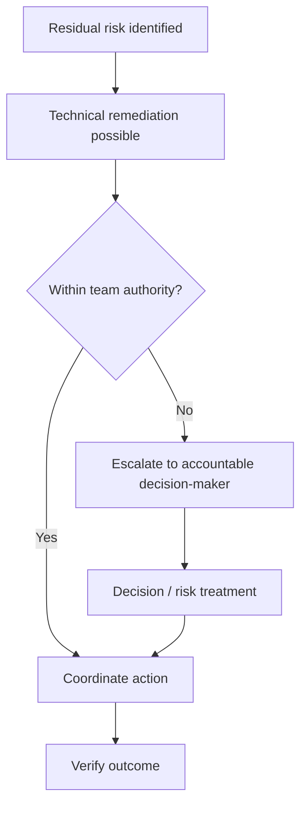

# Scenario 04 — The Conductor Must Escalate

## Situation

A control owner identifies a residual access risk.

IT can technically implement a remediation.

However, the remediation would affect a business process and requires a decision outside the team's authority.

## Visual

## Conductor Analysis

The conductor should not make an unauthorized risk-acceptance decision merely to keep the performance moving.

The correct coordination sequence is:

**Identify → Explain impact → Identify authority → Escalate → Record decision → Coordinate → Verify**

## Learning Point

A conductor can coordinate a decision without owning the decision.

That distinction protects accountability.

## Reflection Questions

- Did the conductor confuse coordination with authority?
- Was the accountable owner identified?
- What evidence supports the escalation?
- What happens if the decision is delayed?
- How will closure be demonstrated?
