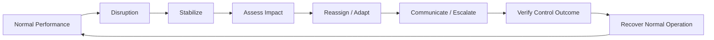

# v0.6 — The Injury

## Purpose

v0.5 established how the conductor coordinates decisions.

v0.6 introduces disruption.

> **What happens when a critical part of the system can no longer perform its normal role?**

“The Injury” is a systems-learning metaphor. It does not mean a literal personal injury. It represents the loss, unavailability, or sudden change of a critical performer, owner, resource, dependency, or process.

The objective is to learn how a GRC / Project Lead preserves the control objective while the normal operating model is disrupted.

## Core Principle

**A resilient system does not depend on one person being continuously available.**

The conductor does not simply replace the missing specialist. The conductor identifies what is affected, stabilizes the outcome, coordinates temporary ownership, preserves evidence, and determines when the normal model can be restored.

## v0.6 Learning Loop

## What This Phase Teaches

- continuity under disruption;
- temporary delegation without losing accountability;
- impact assessment;
- dependency and single-point-of-failure thinking;
- change-management discipline;
- escalation and authority boundaries;
- preservation of evidence;
- re-validation after a workaround or role change.

## Existing System Reused

This phase deliberately reuses:

- the existing OrchestraX roles;
- the existing RACI;
- A.5.16 Identity management;
- A.5.18 Access rights;
- A.5.24 Incident management planning and preparation;
- A.8.32 Change management;
- the existing evidence and validation chain.

No new control is introduced merely to make the scenario work.

## Mental Model

**Disruption → Stabilize → Assess → Reassign → Verify → Recover**

The key distinction:

> **Temporary continuity is not automatically permanent process change.**

Any permanent change to ownership, procedure, or control design must go through the appropriate change and approval path.

