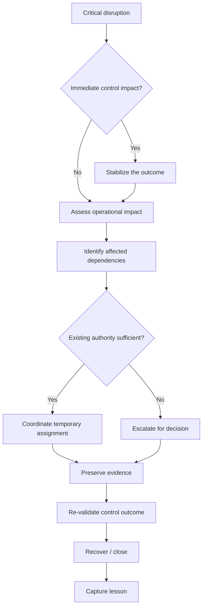
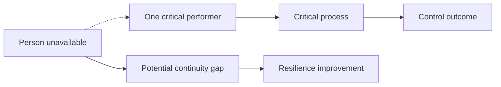

# Disruption Model

## Purpose

The disruption model gives the conductor a repeatable way to respond when a critical role, resource, or dependency becomes unavailable.

## Visual Model

## Four Questions

### 1. What stopped working?

Identify the exact role, resource, process step, or dependency affected.

Do not begin with a solution.

### 2. What outcome is now at risk?

Use the existing control matrix and RACI to identify:

- control objective;
- accountable owner;
- responsible performer;
- dependent activities;
- evidence expected.

### 3. Can the team absorb the disruption?

A temporary reassignment may be appropriate when:

- authority is clear;
- the replacement has sufficient competence;
- the control objective remains intact;
- evidence requirements remain intact;
- the arrangement is understood as temporary.

If these conditions are not met, escalate.

### 4. How do we know recovery worked?

Recovery is not complete because someone resumed the task.

The conductor should verify:

**Outcome → Evidence → Validation**

## Temporary vs Permanent

| Situation | Treatment |
|---|---|
| Person unavailable for a short period | Temporary delegation |
| Workload temporarily redistributed | Temporary coordination adjustment |
| Role permanently changes | Formal role/process change |
| Control design changes | Formal control/change review |
| Evidence method changes | Validate new evidence source |
| Authority changes | Obtain appropriate approval |

## Single Point of Failure

A disruption exposes hidden dependency.

The lesson is not “make everyone able to do everything.”

The lesson is:

> **Know which dependencies are critical enough to require continuity planning.**

## Conductor Boundary

The conductor coordinates the response.

The conductor does not automatically become the substitute specialist.

**Coordinate ≠ Execute**

