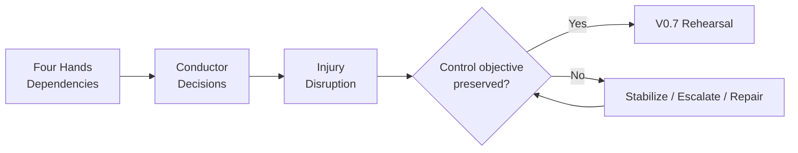

# v0.6 Quality Gate

## Gate Objective

Confirm that “The Injury” teaches disruption and resilience without breaking the established OrchestraX system.

## Continuity Checks

| Check | Result |
|---|---|
| Existing roles reused | PASS |
| Existing RACI remains the source of truth | PASS |
| Existing controls reused | PASS |
| Temporary delegation distinguished from permanent ownership | PASS |
| Control objective preserved during disruption | PASS |
| Evidence and validation preserved | PASS |
| Escalation authority made explicit | PASS |
| Change-management boundary preserved | PASS |
| Single-point-of-failure concept introduced without inventing a new control | PASS |
| Visual-first learning standard met | PASS |
| v0.7 Rehearsal remains the logical next phase | PASS |

## Visual Gate

## Core Learning

v0.5 taught:

**See → Prioritize → Coordinate → Escalate → Verify → Learn**

v0.6 adds:

**Stabilize → Assess → Reassign → Escalate → Verify → Recover**

Combined mental model:

> **The conductor keeps the system coherent when normal performance is disrupted.**

## Gate Decision

**PASS — v0.6 is structurally ready to proceed to v0.7 Rehearsal.**
