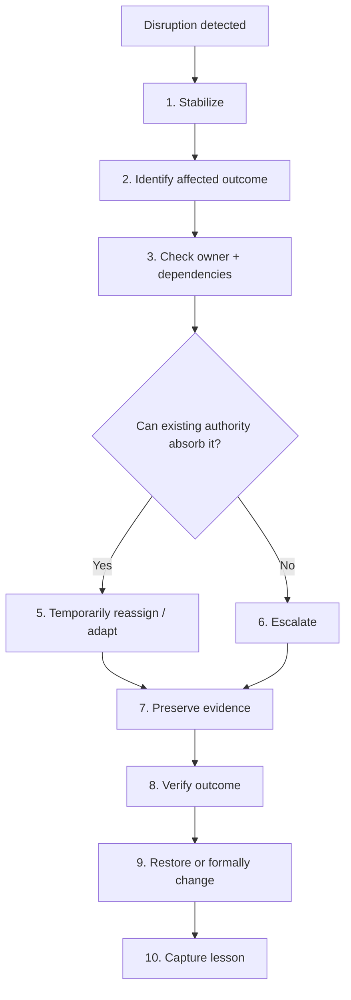

# Disruption Response Playbook

## Purpose

A compact operating model for the conductor when a critical performer, owner, resource, or dependency becomes unavailable.

## Playbook

## Conductor Checklist

### Stabilize
- What must not fail?
- Is there an immediate control or business impact?
- Is any temporary containment needed?

### Assess
- What role/resource/dependency is unavailable?
- Which requirement/control is affected?
- What deadline or dependency is at risk?

### Coordinate
- Who can legitimately perform the work?
- Who remains accountable?
- What authority is required?
- What evidence must still be produced?

### Escalate
Escalate when:

- authority is insufficient;
- the control objective cannot be preserved;
- the workaround creates unacceptable risk;
- a permanent change is being proposed;
- timing cannot be met safely.

### Verify
Do not close on activity alone.

Verify:

**Action → Evidence → Outcome → Validation**

### Recover
Decide whether to:

- return to the normal operating model;
- continue an approved temporary arrangement;
- initiate formal change management.

## Decision Rule

**Absorb** when the existing system can safely handle the disruption.

**Reassign** when a competent and authorized substitute can preserve the outcome.

**Escalate** when authority, risk, timing, or control effectiveness cannot be safely managed at the current level.

## Memory Hook

**Stabilize → Assess → Reassign → Escalate → Verify → Recover**

