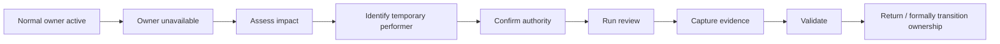

# Scenario 01 — The Missing Section Leader

## Situation

OrchestraX is preparing for an access-control review.

The Control Owner who normally coordinates the review becomes unavailable shortly before the scheduled activity.

The review still has a deadline.

The conductor must keep the outcome moving without silently changing accountability.

## Existing System

Relevant existing elements:

- A.5.15 Access control;
- A.5.18 Access rights;
- existing RACI;
- access-review evidence;
- validation through sampling.

No new control is required.

## Timeline

## Conductor Response

### Step 1 — Stabilize

Determine whether the owner's absence immediately threatens the control outcome or only the coordination activity.

### Step 2 — Assess

Check:

- review deadline;
- available evidence;
- existing Responsible role;
- existing Accountable role;
- whether another authorized person can perform the coordination.

### Step 3 — Reassign Temporarily

If authority permits, coordinate a temporary performer.

The temporary performer should know:

- what outcome is required;
- what evidence is expected;
- what authority they have;
- when the temporary arrangement ends.

### Step 4 — Preserve Accountability

Do not silently rewrite the permanent RACI.

Temporary delegation should be recorded as a temporary arrangement, with the appropriate approval where required.

### Step 5 — Verify

The conductor checks:

**Was the review performed? → Is evidence available? → Did validation confirm the intended access outcome?**

## Failure Mode

The conductor simply takes over the review personally.

This may appear efficient but can create:

- unclear accountability;
- segregation-of-duties concerns;
- hidden dependency;
- undocumented role substitution.

## Decision Point

If no authorized substitute exists and the deadline cannot safely be met:

**Escalate rather than improvise.**

## Learning

> **Resilience is not removing accountability. It is maintaining the outcome when the normal performer is unavailable.**

