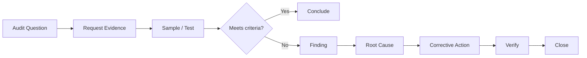

# v0.8 — Performance / Audit Simulation

## Purpose

Move OrchestraX from rehearsal into an audit-style performance.

The question changes from:

> Can we implement and test the control?

to:

> Can we demonstrate, with reliable evidence, that the system operates as intended?

## Core Model

**Audit Question → Evidence → Test → Finding → Root Cause → Corrective Action → Verification → Closure**

## Performance Sequence

1. Define audit objective and scope.
2. Identify criteria and expected evidence.
3. Request/select evidence.
4. Test design and operating effectiveness as appropriate.
5. Record factual results.
6. Classify findings.
7. Identify root cause where corrective action is required.
8. Agree corrective action and owner.
9. Verify completion and effectiveness.
10. Communicate the result.

## Auditor Boundary

The auditor tests and reports against defined criteria. The auditor should not become the control owner or design the organization's corrective solution.

## Existing System Reused

- Requirements and control matrix
- RACI and control ownership
- Dependency/handoff model
- v0.5 decision framework
- v0.6 continuity model
- v0.7 implementation, evidence and testing model

No new control is introduced merely to create the audit simulation.

## Scenarios

- Audit planning and sampling
- Evidence challenge
- Finding classification
- Corrective action and follow-up

## Phase Connection

**Four Hands → Conductor → Injury → Rehearsal → Performance → Retrospective**
