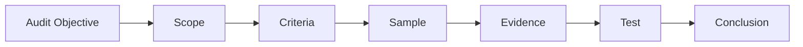

# Audit Plan

## Objective

Assess whether selected OrchestraX controls are implemented and operating in accordance with defined requirements and control expectations.

## Scope

The simulation covers:

- Access control / JML
- Incident response
- Vulnerability management
- Evidence management
- Related ownership, dependencies and supporting records

## Criteria

The auditor uses the project's existing requirements and control matrix as the audit criteria.

## Audit Activities

| Activity | Output |
|---|---|
| Planning | Objective, scope, criteria |
| Opening | Stakeholder alignment |
| Evidence request | Evidence set |
| Testing | Test records |
| Interviews | Factual clarification |
| Sampling | Sample rationale |
| Findings | Factual observations/conclusions |
| Closing | Results and next actions |
| Follow-up | Corrective-action verification |

## Sampling Principle

The sample should be sufficient for the simulation objective and should have a documented rationale. A convenient sample is not automatically a representative sample.

## Auditor Mindset

Ask:

- What requirement or criterion am I testing?
- What evidence would demonstrate it?
- Is the evidence authoritative and attributable?
- Does the sample support the conclusion?
- What exactly did I observe?
- Can the conclusion be reproduced from the audit record?
