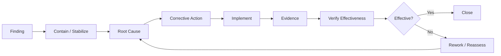

# Audit Scenario — Corrective Action & Follow-up

## Objective

Move from an identified finding to verified improvement.

## Corrective-Action Loop

## Important Distinction

**Correction** addresses the immediate condition.

**Corrective action** addresses the cause so recurrence is less likely.

Example:

- Condition: one leaver record lacked evidence of timely access removal.
- Correction: recover/establish the authoritative record where legitimately available.
- Possible root cause: HR-to-IT handoff was not consistently captured.
- Corrective action: improve the handoff workflow and evidence capture.
- Verification: test subsequent lifecycle events.

## Closure Criteria

Do not close merely because someone says “fixed.”

Closure should consider:

- action implemented;
- evidence available;
- responsible owner identified;
- underlying issue addressed;
- effectiveness tested where appropriate;
- residual risk understood.

> **A closed ticket is not automatically a closed finding.**
