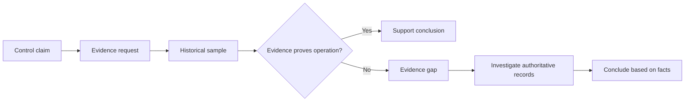

# Audit Scenario — The Evidence Challenge

## Situation

IT states that leaver access is always removed promptly. The auditor requests a sample of recent leavers.

The team produces a current access report and says:

> “The accounts are disabled now, so the control is working.”

## Audit Problem

Current state does not automatically prove historical operation.

## Auditor Questions

1. What event triggered the access action?
2. When was the event recorded?
3. When was access removed?
4. Who or what performed the action?
5. Can the action be traced to the lifecycle event?
6. Does the sample demonstrate the required operating period?
7. Are exceptions visible?

## Possible Outcomes

- **Pass:** reliable evidence demonstrates the expected operation.
- **Observation:** control is demonstrated but evidence quality could improve.
- **Gap:** evidence or operation does not support the required conclusion.
- **Unable to validate:** sufficient evidence cannot be obtained to reach a reliable conclusion.

## Conductor Lesson

The GRC lead should coordinate evidence owners and clarify the evidence chain, but should not manufacture missing evidence or coach the team into an unsupported conclusion.

> **The audit tests the system that exists, not the system everyone intended to have.**
