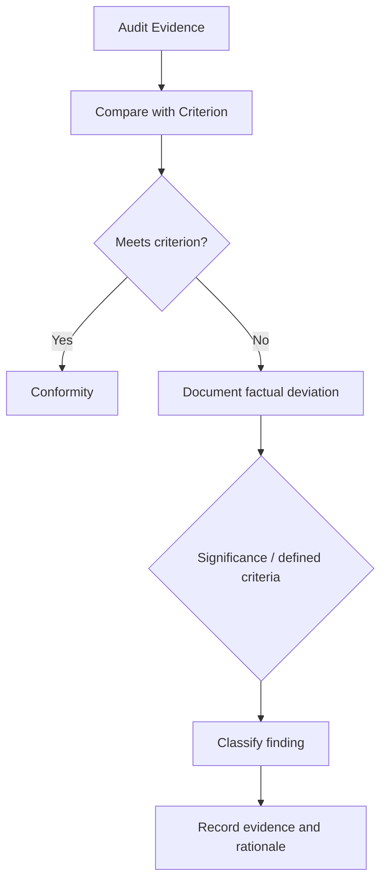

# Audit Scenario — Finding Classification

## Objective

Separate factual audit results from assumptions and distinguish different types of findings.

## Finding Flow

## Finding Record

A useful finding record contains:

- criterion
- condition observed
- objective evidence
- affected scope/sample
- impact or risk context where relevant
- classification
- owner
- required follow-up

## Avoid These Errors

**Error 1 — Overstatement**

One failed sample does not automatically prove that every instance failed.

**Error 2 — Unsupported severity**

Severity should be based on defined criteria and evidence, not personal preference.

**Error 3 — Mixing cause and condition**

“The process failed” describes a broad conclusion. The finding should first state what was actually observed.

**Error 4 — Prescribing the solution**

The auditor identifies the finding. Management/control owners determine the corrective solution, subject to applicable audit rules and independence requirements.

## Memory Hook

**Criterion → Condition → Evidence → Classification → Follow-up**
