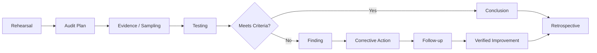

# v0.8 Quality Gate — Performance / Audit

## Gate Objective

Determine whether the project can simulate an evidence-based audit without breaking the ownership, control, evidence or decision models established earlier.

| Check | Result |
|---|---|
| Existing criteria reused | PASS |
| Existing controls reused | PASS |
| RACI and ownership preserved | PASS |
| Audit scope and objective defined | PASS |
| Evidence request/testing path defined | PASS |
| Sampling rationale introduced | PASS |
| Findings separated from assumptions | PASS |
| Finding classification model defined | PASS |
| Correction distinguished from corrective action | PASS |
| Follow-up verification defined | PASS |
| Auditor/control-owner boundary preserved | PASS |
| v0.7 evidence model reused | PASS |
| No orphan controls introduced | PASS |
| Visual-first standard met | PASS |
| v0.9 retrospective supported | PASS |

## Core Lesson

> **Performance is not about appearing ready. It is about producing enough objective evidence for a reviewer to reach a defensible conclusion.**

## v0.8 Decision

**PASS — Performance / Audit Simulation is ready to transition to v0.9 Retrospective.**
