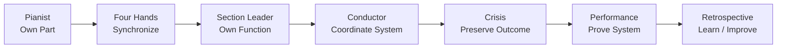

# v0.9 — Retrospective

## Purpose

Step out of the performance and examine what the laboratory actually taught.

The retrospective asks:

> Did the learner move from understanding individual controls to thinking like a conductor of a cross-functional system?

## Learning Progression

## Retrospective Areas

1. Systems thinking
2. Ownership and accountability
3. Dependency and handoff management
4. Decision-making
5. Risk and escalation
6. Resilience and continuity
7. Evidence and audit thinking
8. Communication
9. GRC/technical boundaries
10. Continuous improvement

## Core Question

**Can I explain not only what a control does, but how people, processes, technology, evidence, risk and decisions connect around it?**

## Existing Project Reused

The retrospective evaluates the learning system already built. It does not introduce new controls or pretend that completion of the repository equals professional competence.

## Phase Connection

**Foundation → Orchestra → Score → Four Hands → Conductor → Injury → Rehearsal → Performance → Retrospective → Portfolio**
