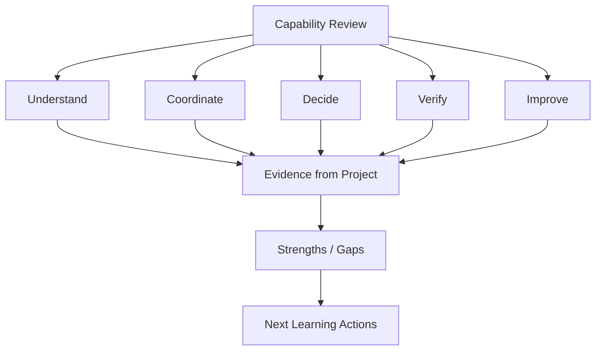

# Capability Assessment

## Purpose

Assess capability gained from the laboratory without treating the exercise as a certification or objective professional competency test.

## Maturity Model

| Capability | Emerging | Working | Strong |
|---|---|---|---|
| Systems thinking | Sees individual tasks | Connects related processes | Explains cross-functional system effects |
| Ownership | Identifies roles | Uses RACI | Protects accountability across dependencies |
| Coordination | Follows handoffs | Manages dependencies | Anticipates coordination failure |
| Decision-making | Reacts to issues | Uses structured questions | Prioritizes and escalates with rationale |
| Risk thinking | Identifies risks | Links risk to action | Balances impact, urgency and residual risk |
| Resilience | Notices disruption | Coordinates continuity | Designs recovery without hiding ownership gaps |
| Evidence | Collects documents | Tests evidence | Distinguishes operation, effectiveness and demonstrability |
| Audit thinking | Answers questions | Traces evidence to criteria | Produces defensible conclusions |
| Corrective action | Fixes symptoms | Identifies causes | Verifies effectiveness |
| Communication | Shares updates | Coordinates stakeholders | Makes complex system state understandable |

## Visual Assessment

## Self-Assessment Questions

For each capability, ask:

1. Can I explain the concept without the analogy?
2. Can I identify the accountable owner?
3. Can I trace requirement → control → evidence?
4. Can I identify the dependency that could break the outcome?
5. Can I explain when I would escalate?
6. Can I distinguish a technical problem from a governance problem?
7. Can I defend an audit conclusion using evidence?
8. Can I identify what should improve next?

## Interpretation

- **Emerging:** needs guided practice.
- **Working:** can apply the model in a structured scenario.
- **Strong:** can adapt the model to unfamiliar situations and explain the reasoning.

> The objective is not to score perfectly. It is to make the next learning gap visible.
