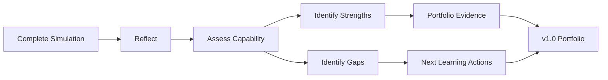

# v0.9 Quality Gate — Retrospective

## Gate Objective

Confirm that the project can extract reusable learning from the complete simulation without confusing project completion with professional competence.

| Check | Result |
|---|---|
| Full learning progression reviewed | PASS |
| Systems-thinking lessons captured | PASS |
| Ownership lessons captured | PASS |
| Dependency/handoff lessons captured | PASS |
| Decision and escalation lessons captured | PASS |
| Resilience lessons captured | PASS |
| Evidence/audit lessons captured | PASS |
| Corrective-action lessons captured | PASS |
| Capability model created | PASS |
| Self-assessment questions created | PASS |
| Learning gaps connected to next actions | PASS |
| No claim of certification/competence made | PASS |
| Existing project concepts preserved | PASS |
| Visual-first standard met | PASS |
| v1.0 portfolio release supported | PASS |

## Core Lesson

> **A good retrospective converts experience into a reusable operating model.**

## v0.9 Decision

**PASS — Retrospective is ready to transition to v1.0 Portfolio Release.**
