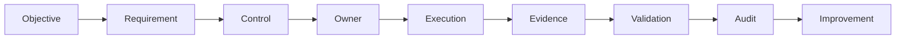

# Portfolio Case Study

## From Pianist to Conductor

### Challenge

GRC and project management can become fragmented when standards, controls, risk, evidence, stakeholders and delivery activities are studied separately.

### Approach

I designed a fictional ISO/IEC 27001 implementation laboratory around the conductor metaphor.

The project progressively models:

**roles → requirements → controls → dependencies → decisions → disruption → implementation → evidence → audit → improvement**

### Design Principle

The conductor is not the person who performs every specialist task.

The conductor creates alignment between specialists, ownership, timing, dependencies, risk, evidence and decisions.

### What Was Built

- project charter and scope
- stakeholder and role maps
- RACI
- requirements and control mapping
- control traceability
- dependency and handoff models
- JML scenario
- coordination decision framework
- escalation scenarios
- disruption/continuity model
- implementation rehearsals
- evidence-testing model
- audit simulation
- finding classification
- corrective-action verification
- retrospective and capability assessment

### Key Learning

The project changed the mental model from:

> “Do I know every technical task?”

to:

> “Can I understand the system well enough to coordinate the right people toward the right outcome, preserve accountability, and verify the result?”

### Evidence of Systems Thinking

The strongest reusable model is:

The project also tests what happens when normal execution breaks, forcing consideration of temporary ownership, authority, escalation and recovery.

### Outcome

The final repository is a structured learning and portfolio artifact demonstrating GRC systems thinking, project coordination, evidence awareness, audit reasoning and resilience.

### Limitations

This is a simulated environment. It does not demonstrate production-scale implementation, certification audit experience, or independent professional competence by itself.

### Portfolio Takeaway

> **Good GRC is not only knowing the controls. It is understanding how the entire system must work together for the control objective to survive real-world execution.**
