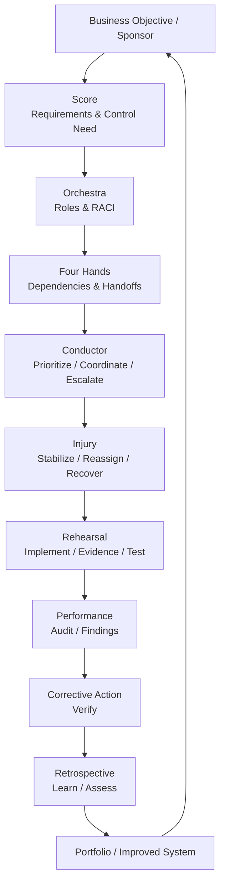

# Final System Map

## Complete Laboratory

## Core Traceability Chain

**Business Objective → Requirement → Risk/Control Need → Control → Owner → Implementation → Evidence → Testing → Finding → Corrective Action → Improvement**

## Coordination Chain

**See → Prioritize → Coordinate → Escalate → Verify → Learn**

## Evidence Chain

**Activity → Evidence → Test → Conclusion → Finding/Pass → Follow-up**

## Resilience Chain

**Disruption → Stabilize → Assess → Reassign → Escalate → Verify → Recover**

## Memory Model

> **Score tells us what should happen.**  
> **Orchestra tells us who is involved.**  
> **Four Hands tells us how specialists connect.**  
> **Conductor tells us how the system is coordinated.**  
> **Injury tests resilience.**  
> **Rehearsal tests operation.**  
> **Performance tests assurance.**  
> **Retrospective converts experience into learning.**
