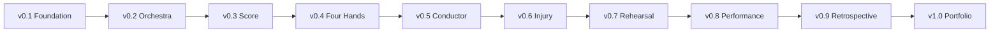

# v1.0 Quality Gate — Portfolio Release

## Final Gate

| Check | Result |
|---|---|
| v0.1–v0.9 phases represented | PASS |
| Core analogy remains consistent | PASS |
| GRC/PM boundary remains clear | PASS |
| Requirements → controls traceability preserved | PASS |
| RACI remains the ownership source | PASS |
| Dependencies/handoffs remain connected | PASS |
| Decision framework remains connected | PASS |
| Disruption model remains connected | PASS |
| Rehearsal/evidence model remains connected | PASS |
| Audit model remains connected | PASS |
| Retrospective remains connected | PASS |
| Final system map created | PASS |
| Portfolio case study created | PASS |
| Educational/fictional boundaries stated | PASS |
| No unsupported certification claim | PASS |
| Visual-first standard met | PASS |
| Repository is suitable as a portfolio learning artifact | PASS |

## Final Decision

**PASS — v1.0 Portfolio Release complete.**

## Final Project Principle

> **Understand the part. See the system. Coordinate the specialists. Preserve the outcome. Prove the result. Learn from the performance.**
