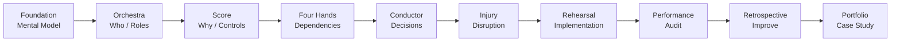
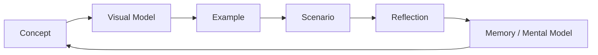

# From Pianist to Conductor — GRC & Project Management Systems Lab

A scenario-based learning laboratory that uses musical performance as a systems-thinking model for Governance, Risk & Compliance (GRC) and project management.

## Purpose

This project explores a central question:

> What changes when a specialist stops focusing only on their own part and becomes responsible for coordinating the whole system?

The musical model is a learning device, not a claim that GRC and orchestral work are identical.

## Learning Model

| Musical concept | GRC / Project Management analogue |
|---|---|
| Composer | Sponsor / management defining the desired outcome |
| Score | Requirements, policies, standards and control objectives |
| Conductor | GRC Lead / Project or Program Coordinator |
| Section leader | Control owner / functional lead |
| Musician | SME / individual contributor |
| Orchestra | Cross-functional project team |
| Rehearsal | Workshop, implementation, testing and evidence collection |
| Performance | Audit, certification, management review or final delivery |
| Audience | Management, client, auditor or stakeholder |
| Wrong note | Control gap, execution error or evidence failure |
| Tempo | Schedule, cadence and delivery rhythm |
| Cue | Communication, escalation or dependency handoff |

## Core Principle

The conductor does not play every instrument.

Likewise, a GRC/project lead does not need to execute every technical, HR, legal or operational task. The role is to understand the system well enough to coordinate specialists toward a coherent outcome.

## Project Scenario

The fictional organization **OrchestraX** is preparing for an ISO/IEC 27001 implementation.

The laboratory will progressively introduce:

1. Project charter and scope
2. Stakeholder and role mapping
3. RACI and control ownership
4. Requirements and control mapping
5. Dependencies and handoffs
6. Risk management
7. GRC coordination scenarios
8. Control implementation and testing
9. Internal audit simulation
10. Findings and corrective actions
11. Retrospective and lessons learned

## Quality Gate

Each release is checked for:

- role and stakeholder continuity;
- requirement-to-control traceability;
- ownership and RACI alignment;
- terminology consistency;
- evidence and validation linkage;
- dependencies between current and future phases.

A later phase must update the relevant source-of-truth file when it introduces or changes an established concept.

## Version Roadmap

- **v0.1 — Foundation:** learning architecture and analogy framework
- **v0.2 — Orchestra:** stakeholders, roles, RACI and ownership
- **v0.3 — Score:** requirements, controls and project structure
- **v0.4 — Four Hands:** collaboration, dependencies and handoffs
- **v0.5 — Conductor:** coordination and decision scenarios
- **v0.6 — The Injury:** disruption and change-management simulation
- **v0.7 — Rehearsal:** implementation, testing and evidence
- **v0.8 — Performance:** audit simulation
- **v0.9 — Retrospective:** lessons learned and capability assessment
- **v1.0 — Portfolio Release:** polished case study and learning artifact

## Status

**Current release: v0.5 — Conductor**

This is an evolving learning laboratory. Each phase has a continuity quality gate before the project advances. New concepts must connect to an existing source of truth rather than appearing only inside a scenario. v0.4 demonstrates this by reusing the existing RACI, control matrix and selected controls rather than creating parallel ownership models.

## Visual Project Roadmap

### Visual Index

| Need | Start here |
|---|---|
| Understand the whole learning method | [Visual Learning System](01-concept/visual-learning-system.md) |
| Understand conductor vs GRC/PM | [Conductor vs Project Manager](01-concept/conductor-vs-pm.md) |
| See the complete GRC system | [Orchestra to GRC Systems Map](01-concept/orchestra-to-grc.md) |
| Understand roles quickly | [Musical Roles and GRC Roles](01-concept/musical-roles.md) |
| Understand ownership | [RACI](03-orchestra/RACI.md) |
| Understand requirements and controls | [The Score](04-score/requirements.md) |
| Trace controls to evidence | [Control Matrix](04-score/control-matrix.md) |
| Understand Four Hands collaboration | [Four Hands](04-four-hands/README.md) |
| Map dependencies | [Dependencies](04-four-hands/dependencies.md) |
| Understand handoffs | [Handoffs](04-four-hands/handoffs.md) |
| Run the JML rehearsal | [JML Scenario](04-four-hands/scenario-jml.md) |
| Understand conductor decisions | [Conductor](06-conductor-scenarios/README.md) |
| Use the decision framework | [Decision Framework](06-conductor-scenarios/decision-framework.md) |
| Practice coordination scenarios | [Conductor Scenarios](06-conductor-scenarios/scenario-01-tempo.md) |
| Check project continuity | [Quality Gate](06-conductor-scenarios/quality-gate.md) |

## Disclaimer

The musical analogy is an educational framework. It does not replace formal ISO/IEC 27001 requirements, organizational procedures, professional judgment, or audit guidance.

## ADHD-Friendly Visual Learning Standard

This laboratory is designed for **active, visual learning**, not document accumulation.

### Default rule

When a concept involves **relationships, sequence, hierarchy, ownership, dependency, or decision flow**, the project should provide a visual model alongside the written explanation.

Preferred formats:

- **Mind map** — for concepts and relationships
- **Flowchart** — for processes and sequences
- **System map** — for cross-functional relationships
- **RACI/table** — for ownership
- **Traceability chain** — for requirements-to-evidence relationships
- **Scenario timeline** — for events and escalation
- **Decision tree** — for choosing an action

Plain English remains the explanation layer. Visuals become the **working-memory layer**.

### Visual-first learning loop

A visual is not decoration. It must reduce cognitive load or make a relationship easier to see.

## Visual Learning Standard

This project uses an ADHD-friendly visual learning standard: concepts involving relationships, sequence, ownership, dependencies, or decisions should include an appropriate visual model. See [01-concept/visual-learning-system.md](01-concept/visual-learning-system.md).
